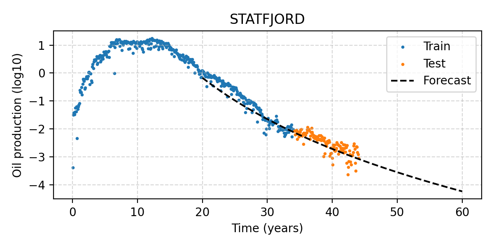

[](https://github.com/equinor/decline-curve-analysis/actions/workflows/DCA_package.yml)

# decline-curve-analysis

**This code is used internally by Equinor, but open sourced to share knowledge with others who might be interested in DCA.
Contributions will only be accepted if they align with our internal goals, so please create an issue and discuss before creating PRs.**

## Purpose

[dca-doc]: https://dsadocs.equinor.com/docs/decline-curve-analysis/
[github-actions-file]: https://github.com/equinor/decline-curve-analysis/blob/main/.github/workflows/DCA_package.yml
[adca-deployment]: https://github.com/equinor/adca-deployment/

**If you're in Equinor and you want to use ADCA, we recommend that you contact us to get started:
Knut Utne Hollund `kuho@equinor.com` or Tommy Odland `todl@equinor.com`.**

<p align="center">
  
</p>

This repository contains code and theory for decline curve analysis (DCA).
The full documentation can be found in the [dca-doc].
A project concerned with deploying ADCA with a friendly user-interface may be found at [adca-deployment].

Two Python packages are provided:

- `dca`: core mathematical routines (decline curve functions, loss functions, time series pre-processing, etc.)
- `adca`: automatic DCA system (data loaders, config file readers, plotting, logging, output handling, pre-preprocessing, hyperparameter tuning, etc.)

The `adca` system wraps the building blocks found in `dca` into a feature-complete and more user friendly system that automatically performs DCA on a set of local files or a data source such as the Production Data Mart (PDM).


## Getting Started

## Prerequisites

The Python programming language and `git` to clone the repo.
See `pyproject.toml` and the [github-actions-file] for information about versions.

```
git clone https://github.com/equinor/decline-curve-analysis.git
cd decline-curve-analysis
pip install -e .
```

## Usage

A CLI is provided that runs `adca` on a set of `.yaml` config files.
```
adca --help
```

See the documentation for [dca-doc] for examples of usage.

### Project Structure

```
.github/workflows  <- GitHub Actions files
dca                <- The DCA package
docs               <- Sphinx documentation
examples           <- Examples for Sphinx gallery
tests              <- Tests for the DCA package
```

### Implementation

There are several proposed implementations of the DCA. 
It could be integrated as a scheduled job into corporate database like PDM, integration onto tools like pForecast and ResInsight, etc

## Methods

See the documentation in [dca-doc].

## Assumptions & Limitations

See the documentation in [dca-doc].

## Technical Documentation

See the documentation in [dca-doc].

## Data Documentation

The `dca` package is data-agnostic: it only implements low-level math.

The `adca` package has several data loaders, and can in principle be extended to any data source.
One of the current data sources is the Equinor database Production Data Mart (PDM).
To obtain access, you need to apply in AccessIT.
You will also need the [pdm_datareader](https://github.com/equinor/pdm-datareader) package, which is open source and included in `pyproject.toml`.

## Input Data

The following table provides context about the data sources that may be used:

| Dataset Name | Dataset Description | Data Storage | Data Format| Data Access |
| ---------- | ----------- | ----------- | ----------- | ----------- |
| `PDMVW.WB_PROD_DAY` | Daily production data | PDM | Tabular | AccessIT |
| Local files | Daily production data | local CSV | Tabular with columns `well_id`, `time`, `production`, `time_on` | Not applicable |

### Data Filtering & Retrieval

| Table Name | Description |
| ---------- | ----------- |
| `PDMVW.WB_PROD_DAY` | Filtering depends on data preprocessing rules in `adca` |
| Local files | Filtering depends on data preprocessing rules in `adca` |

## Output Data

The following table provides context about the output datasets that are produced by `adca`:

| Dataset Name | Dataset Description | Data Storage | Data Format| Data Access |
| ---------- | ----------- | ----------- | ----------- | ----------- |
| `curve_parameters.csv` | Curve parameters per well | Stored in `/output` folder  | Tabular | None |
| `forecast.csv` | Forecasted values | Stored in `/output` folder  | Tabular | None |

In addition, a log and many debugging figures are output.

### Data appended to existing databases

None.

## Testing

See the [github-actions-file] for information about how to run tests.

## Continuous Integration (CI)

See the [github-actions-file].

## Report error/feature requests

Please create a new issue in this repository.
Add relevant tags to help categorise the issue, and assign the issue to the relevant assignee.

## Releases

Releases will be implemented using GitHub Releases functionality. 
Versioning will be implemented in accordance with SemVer best practices. 

## Contributing

Feel free to create a new branch and submit a Pull Request.
Before doing this, talk to us about the work you wish to do, for instance in an Issue.

## Citation

If you'd like to cite this repo - we recommend citing as such, where the version can be found in the current tag: 

*Equinor. 2025. decline-curve-analysis (insert version) [Source Code]. Github. https://github.com/equinor/decline-curve-analysis*

Any related publications from our team will be posted here as they become available.

## Useful Links

* The documentation in [dca-doc].

### References

* See the documentation in [dca-doc] for information about references.

## To Do

For upcoming tasks, please refer to the GitHub issues, the Azure DevOps board for the DSA team, or contact us directly for discussion.

## Contact Us

For any questions, concerns, or further assistance, please feel free to reach out to the following contacts:

* Knut Utne Hollund `kuho@equinor.com`
* Tommy Odland `todl@equinor.com`
